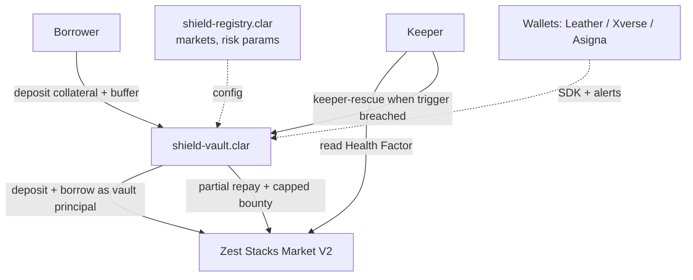
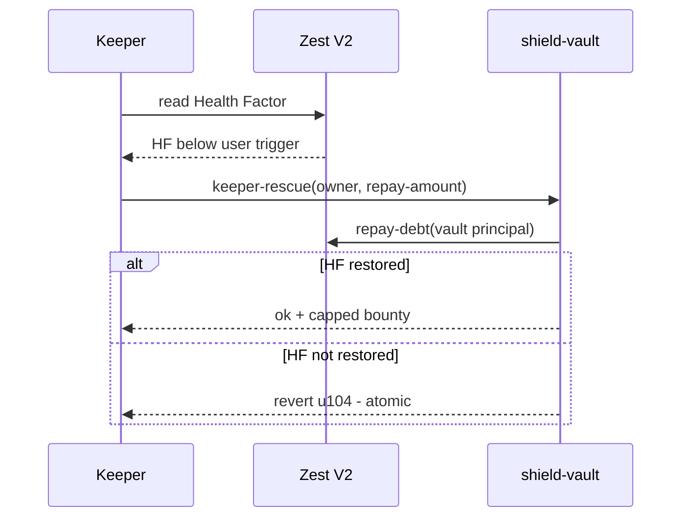

# Shield Vaults

**Liquidation protection vaults for Stacks lending protocols.**

Permissionless keeper-driven vaults that automatically protect borrowers'
positions on Stacks lending (Zest first) from liquidation. Users deposit
collateral into a Shield vault, the vault opens and owns the borrow position,
and keepers atomically repay a slice of the debt when the Health Factor
breaches the user's trigger - restoring health before liquidation, for a
capped bounty. Monitor-only mode + Telegram/email alerts for positions users
don't want to move.

> **Status: PoC (v0.1).** Compiles and passes `clarinet check`
> (Clarinet v3.24.0) + **5 passing unit tests** proving the core rescue
> mechanics. Zest Stacks Market V2 integration (real principals +
> signatures) is milestone 1 of the roadmap. See `docs/technical-spec.md`.

## Why this exists

- Zest holds ~$76M of Stacks' ~$89M DeFi TVL; positions become eligible for
  full liquidation when Health Factor < 1 (partial slightly above 1)
- Stack Sats (Sep-Dec 2026) is onboarding thousands of new Zest USDCx
  borrowers; liquidated positions lose their Stack Sats rewards
- No liquidation-protection or collateral-risk product exists on Stacks
  (ecosystem review, Sep 2026)

## Architecture





- **Vault-as-principal:** Zest V2's `borrow` takes the user as a parameter
  (Protocol Deep Dive: `market.borrow(usdc-aid, 500, tx-sender, none)`),
  so the vault contract can own and manage the position
- **Keeper + flag:** the pattern the Clarity Working Group identifies as the
  Stacks standard (Clarity has no autonomous execution)
- **Safety:** post-rescue Health Factor must be ≥ trigger or the whole tx
  reverts; buffer capped at 10% of borrow; bounty capped at 2%; no admin key,
  no upgrade path

**Full architecture** - component, contract, keeper-bot, state and sequence
diagrams: [`docs/architecture.md`](docs/architecture.md)

## Contracts

| Contract | Purpose |
|---|---|
| `contracts/shield-vault.clar` | Core vault: `open-vault`, `keeper-rescue`, `user-repay`, `user-topup`, `close-vault`, `register-monitor` |

Lending market + tokens are passed as **trait parameters**
(`<lending-market-trait>`, `<sip010-trait>`), so the scaffold compiles
standalone; real Zest V2 principals are wired in milestone 1.

## Build & Test

```bash
clarinet check        # syntax + type check (Clarinet v3.24.0)
npm install           # install @stacks/clarinet-sdk + vitest
npm test              # run the unit test suite (clarinet must be on PATH)
```

The test suite (`tests/shield-vault.test.ts`) drives a mock lending market
and proves the protection mechanics end-to-end:

1. user can open a protected vault
2. keeper rescue executes when trigger breached and health restored
   (buffer reduced by repay + capped bounty)
3. keeper rescue reverts when health is above trigger (u103)
4. keeper rescue reverts when repay amount exceeds buffer (u105)
5. keeper rescue reverts when post-state health is not restored (u104)

## Roadmap (8-12 weeks)

1. **Wk 0-4:** technical spec (done, `docs/`), testnet deployment, Zest V2
   testnet integration
2. **Wk 4-7:** mainnet deployment, open-source keeper bot, alerts,
   monitor-only mode (20 users)
3. **Wk 7-10:** 25+ protected vault users, first keeper rescue on mainnet
4. **Wk 10-12:** Granite integration, Shield SDK, wallet integration demo

## Docs

- `docs/architecture.md` - full architecture: component, contract, keeper-bot,
  vault lifecycle and sequence diagrams
- `docs/technical-spec.md` - architecture, Zest V2 integration facts, safety
- `docs/research-notes.md` - ecosystem research: why this gap exists, Zest V2
  liquidation mechanics, keeper infrastructure state, project landscape

## License

MIT
