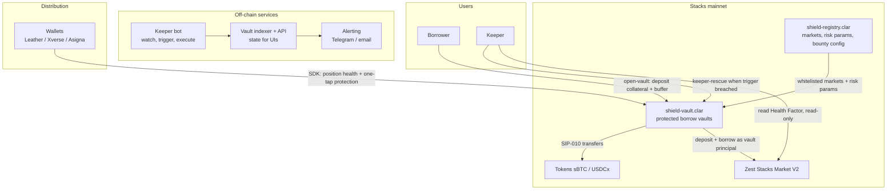
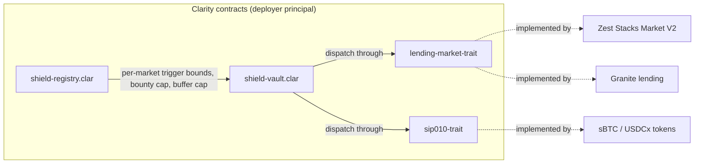
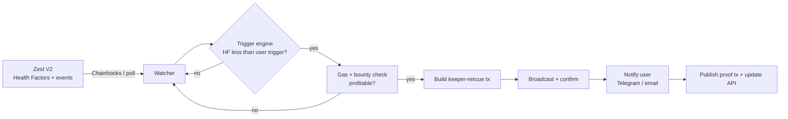
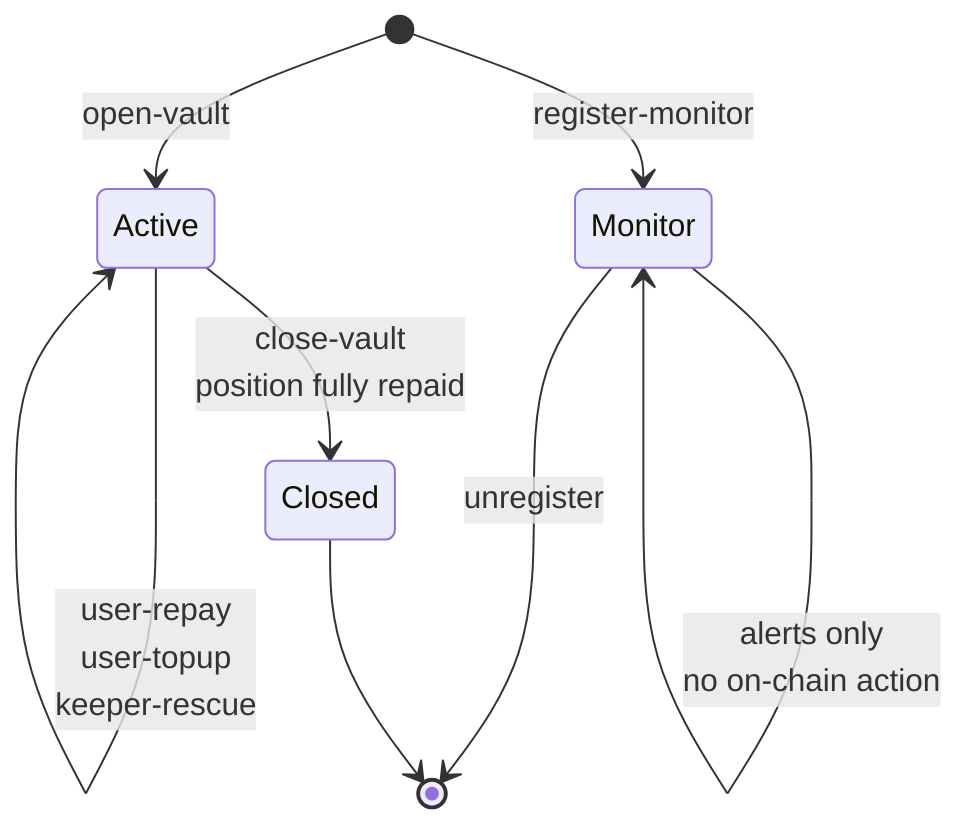
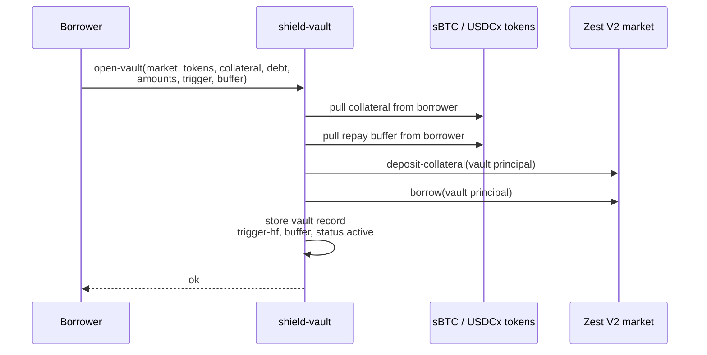
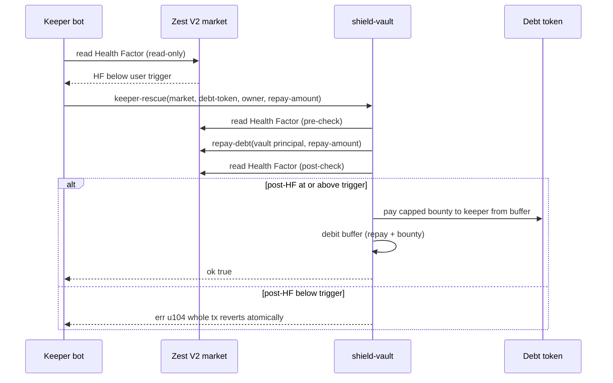

# Shield Vaults - Architecture

Protection layer for Stacks lending positions. This document describes the
target architecture (v0.1 contract + keeper bot now; registry and SDK layers
in milestones 2-4).

## 1. System overview



## 2. Contracts & on-chain layer



- **shield-vault.clar (v0.1)** - vault lifecycle: `open-vault`,
  `keeper-rescue`, `user-repay`, `user-topup`, `close-vault`,
  `register-monitor`. The vault is the position principal on the lending
  market. No admin key, no upgrade path.
- **shield-registry.clar (milestone 2)** - whitelist of audited lending
  markets, per-market risk parameters (trigger bounds, bounty cap, buffer
  cap), keeper discovery data. Read-only for vaults; makes multi-protocol
  support safe and configurable without touching the vault contract.
- **Traits** - `lending-market-trait` and `sip010-trait` decouple the vault
  from any single protocol. Adding Granite = one registry entry + trait
  conformance check, zero vault changes.

## 3. Off-chain layer - keeper bot



- **Watcher** - subscribes to position/price state via Chainhooks events or a
  block-level poll; never holds keys beyond a hot wallet for gas.
- **Trigger engine** - compares live Health Factor against each vault's
  trigger; only profitable rescues (bounty > gas) are proposed.
- **Executor** - builds and broadcasts `keeper-rescue`; the contract's
  post-state check guarantees the keeper is only paid when safety is
  actually restored.
- **Alerting + API** - every state change is surfaced to the user and to the
  public vault indexer.

## 4. Vault lifecycle



## 5. Core flow - opening a protected vault



## 6. Core flow - keeper rescue



## 7. Safety invariants

1. **Vault funds only move** to: the lending market (deposit/borrow/repay),
   the vault owner (withdrawals), or keepers (bounty ≤ cap). No other sinks.
2. **No rescue without restoration** - post-state Health Factor must be at or
   above the trigger, otherwise the entire transaction reverts (u104),
   including the bounty.
3. **No griefing healthy vaults** - keeper-rescue reverts when the position
   is above trigger (u103).
4. **Buffer and bounty caps** - buffer ≤ 10% of borrow value; bounty 2% of
   the repaid amount, capped.
5. **No admin, no upgrade path** - after deployment there is no privileged
   caller; risk parameters live in the read-only registry.
6. **Protocol-agnostic via traits** - a new market can be added without
   touching vault code; a broken market can be delisted in the registry.

## 8. Evolution (milestones)

| Milestone | Layer | What changes |
|---|---|---|
| M1 (now) | Contracts | v0.1 vault on testnet, real Zest V2 principals wired |
| M2 | Contracts + off-chain | shield-registry.clar, keeper bot, alerting, monitor-only mode |
| M3 | Product | 25+ protected vaults, first mainnet rescue, user interviews |
| M4 | Distribution | Granite via registry, SDK for wallets, integration demo |

    Monitor --> [*] : unregister
    Closed --> [*]
```
